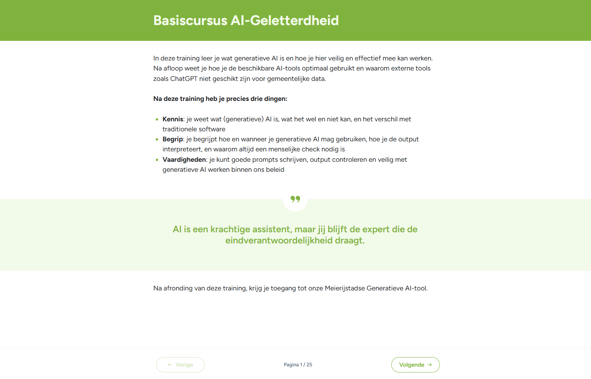
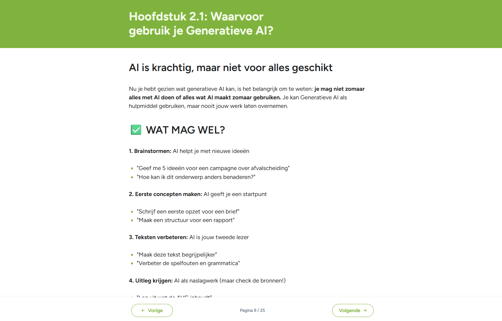
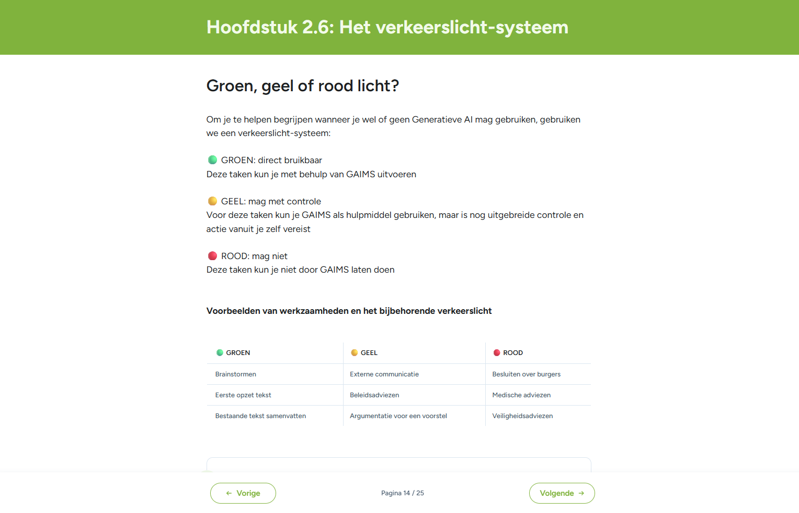

# AI-geletterdheid

De **Europese AI-verordening** (AI Act) verplicht organisaties die AI-systemen inzetten om te zorgen dat medewerkers over voldoende **AI-geletterdheid** beschikken. Sinds februari 2025 is dit een wettelijke verplichting. GovChat-NL ondersteunt overheidsorganisaties hier op twee manieren bij: een compacte overlay in het platform zelf, en een uitgebreide basiscursus die door gemeente Meierijstad is ontwikkeld en vrij beschikbaar is.

## AI-geletterdheid in GovChat-NL

GovChat-NL bevat een **overlay** met een beknopt AI-geletterdheidsonderdeel en een **transparantieverklaring**. Deze overlay wordt getoond aan gebruikers binnen het platform en biedt een eerste bewustwording over verantwoord AI-gebruik.

## Basiscursus AI-Geletterdheid (Meierijstad)

Gemeente Meierijstad heeft een uitgebreide basiscursus AI-Geletterdheid ontwikkeld in eigen omgeving. Deze cursus wordt vrij gedeeld zodat andere organisaties er gebruik van kunnen maken.

In deze training leer je wat generatieve AI is en hoe je hier veilig en effectief mee kan werken. Na afloop weet je hoe je de beschikbare AI-tools optimaal gebruikt en waarom externe tools zoals ChatGPT niet geschikt zijn voor gemeentelijke data.

**Na deze training heb je precies drie dingen:**

- **Kennis**: je weet wat (generatieve) AI is, wat het wel en niet kan, en het verschil met traditionele software
- **Begrip**: je begrijpt hoe en wanneer je generatieve AI mag gebruiken, hoe je de output interpreteert, en waarom altijd een menselijke check nodig is
- **Vaardigheden**: je kunt goede prompts schrijven, output controleren en veilig met generatieve AI werken binnen ons beleid

> *AI is een krachtige assistent, maar jij blijft de expert die de eindverantwoordelijkheid draagt.*

### Wat mag wel en wat mag niet?

De cursus leert medewerkers duidelijk onderscheiden waarvoor je generatieve AI wel en niet mag inzetten. Je mag niet zomaar alles met AI doen of alles wat AI maakt zomaar gebruiken. Je kan Generatieve AI als hulpmiddel gebruiken, maar nooit jouw werk laten overnemen.

**Wat mag wel?**

1. **Brainstormen** — AI helpt je met nieuwe ideeën
   - *"Geef me 5 ideeën voor een campagne over afvalscheiding"*
   - *"Hoe kan ik dit onderwerp anders benaderen?"*
2. **Eerste concepten maken** — AI geeft je een startpunt
   - *"Schrijf een eerste opzet voor een brief"*
   - *"Maak een structuur voor een rapport"*
3. **Teksten verbeteren** — AI is jouw tweede lezer
   - *"Maak deze tekst begrijpelijker"*
   - *"Verbeter de spelfouten en grammatica"*
4. **Uitleg krijgen** — AI als naslagwerk (maar check de bronnen!)
   - *"Leg uit wat de AVG inhoudt"*

### Het verkeerslicht-systeem

Om medewerkers te helpen begrijpen wanneer je wel of geen Generatieve AI mag gebruiken, hanteert de cursus een verkeerslicht-systeem:

| | GROEN | GEEL | ROOD |
|---|---|---|---|
| **Status** | Direct bruikbaar | Mag met controle | Mag niet |
| **Betekenis** | Deze taken kun je met behulp van AI uitvoeren | AI als hulpmiddel, maar uitgebreide controle en actie vanuit je zelf vereist | Deze taken kun je niet door AI laten doen |
| **Voorbeeld** | Brainstormen | Externe communicatie | Besluiten over burgers |
| **Voorbeeld** | Eerste opzet tekst | Beleidsadviezen | Medische adviezen |
| **Voorbeeld** | Bestaande tekst samenvatten | Argumentatie voor een voorstel | Veiligheidsadviezen |

## Wettelijk kader

### EU AI-verordening (AI Act)

Artikel 4 van de AI-verordening stelt:

> Aanbieders en gebruiksverantwoordelijken van AI-systemen nemen maatregelen om, zoveel mogelijk, te zorgen voor een toereikend niveau van AI-geletterdheid bij hun personeel en andere personen die namens hen AI-systemen bedienen en gebruiken.

Dit geldt voor **alle organisaties** die AI inzetten, inclusief overheidsorganisaties.

### Wat betekent dit voor de overheid?

Overheidsorganisaties moeten:

1. **Medewerkers trainen** in het verantwoord gebruik van AI
2. **Bewustzijn creëren** over de mogelijkheden en beperkingen van AI
3. **Richtlijnen opstellen** voor het gebruik van AI in werkprocessen
4. **Documenteren** welke maatregelen zijn genomen

