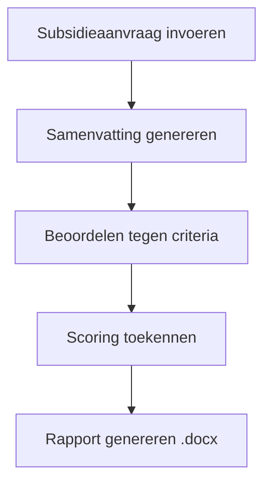

# ToeKenner

De **ToeKenner** is een geavanceerde tool voor het verwerken en beoordelen van subsidieaanvragen met behulp van taalmodellen.

:::caution In ontwikkeling
De ToeKenner wordt momenteel ontwikkeld bij Provincie Limburg. De verwachte beschikbaarheid wordt later bekendgemaakt.
:::

## Algoritme

De ToeKenner werkt in twee fasen:

### Fase 1: Eenmalige voorbereiding

Beoordelingscriteria worden automatisch geëxtraheerd uit de subsidievoorwaarden.

### Fase 2: Per aanvraag

1. **Invoer** — De subsidieaanvraag wordt ingevoerd
2. **Samenvatting** — Een automatische samenvatting wordt gegenereerd
3. **Beoordeling** — De aanvraag wordt beoordeeld tegen de eerder geëxtraheerde criteria
4. **Rapport** — Een gedetailleerd beoordelingsrapport wordt gegenereerd als Word-document (.docx)
