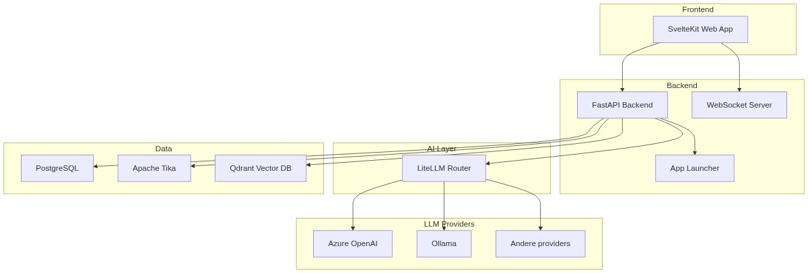

# Componenten & Stack

GovChat-NL is opgebouwd uit meerdere open-source componenten die samen een complete AI-oplossing vormen.

## OpenWebUI

De web-interface en backend van GovChat-NL. Biedt:

- **Chat-functionaliteit** — Vergelijkbaar met ChatGPT, met ondersteuning voor meerdere modellen
- **Gebruikersbeheer** — Rollen, groepen en RBAC
- **App Launcher** — Centrale hub voor AI-toepassingen
- **Knowledge Base** — Upload en raadpleeg documenten

## LibreChat (pre-release)

Alternatieve frontend/backendlijn die momenteel als pre-release wordt onderzocht:

- **Custom endpoint integratie** — Koppeling naar `n8n-openai-bridge`
- **Streaming chat-afhandeling** — Realtime responsrichting via bridge + n8n
- **n8n orchestration als default route** — Standaardchat kan via orchestrator-workflow lopen
- **Governed model routing** — Via LiteLLM + workflowselectie

Meer details: [LibreChat architectuur (pre-release)](./librechat) en [LibreChat quick start](../handleidingen/librechat-pre-release)

## LiteLLM

Fungeert als router en adapter tussen de applicatie en AI-modellen:

- **Multi-provider** — Gebruik meerdere vendors en modellen naast elkaar (Azure, Google, Ollama, etc.)
- **Load balancing** — Verdeel verkeer over meerdere endpoints
- **Fallback** — Automatisch overschakelen bij storingen
- **Monitoring** — Inzicht in gebruik en kosten
- **Latency-based routing** — Automatisch het snelste endpoint kiezen

## n8n

Workflow automation platform voor het bouwen van complexe AI-workflows:

- Visuele workflow builder
- Integratie met externe systemen
- Mogelijkheid tot het bouwen en combineren van agents

## Apache Tika

Document processing voor het verwerken van uploads:

- PDF, Word, Excel, PowerPoint
- Tekst extractie voor RAG (Retrieval Augmented Generation)

## Qdrant

Vector database voor Retrieval Augmented Generation (RAG) en kennisbank-functionaliteit:

- **Vector opslag** — Opslaan van embeddings voor documenten en kennisbronnen
- **Semantisch zoeken** — Zoek relevante context op basis van betekenis, niet alleen trefwoorden
- **RAG pipeline** — Voorziet het taalmodel van relevante context uit organisatie-documenten

## PostgreSQL

Database voor alle persistente data:

- Gebruikers en authenticatie
- Chatgeschiedenis
- Configuratie en instellingen
- Knowledge base metadata

## Zie ook

- [Infrastructuur](./infrastructuur) — Docker stack en deployment-keuzes
- [LibreChat architectuur (pre-release)](./librechat) — Componenten en datastromen van de LibreChat-route
