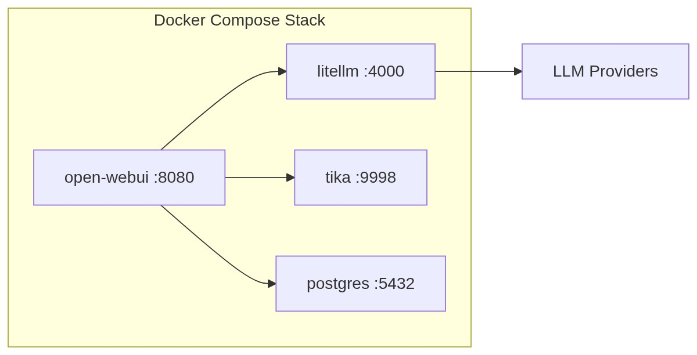

# Infrastructuur

## Deployment opties

Bij het implementeren van GovChat-NL zijn er twee hoofdkeuzes:

| Keuze | Optie A | Optie B |
|-------|---------|---------|
| **Installatie** | Docker image (aanbevolen) | Broncode |
| **Hosting** | Cloud hosting | Lokale servers |

:::tip
Voor productie-omgevingen raden we **Docker** aan. Dit vereenvoudigt installatie, updates en beheer. Zie de [Deployment handleidingen](../handleidingen/deployment/overzicht) voor stapsgewijze instructies.
:::

## Docker Stack

De standaard GovChat-NL stack bestaat uit verschillende containers:

| Container | Image | Functie |
|-----------|-------|---------|
| **open-webui** | `ghcr.io/open-webui/open-webui` | Web-interface en backend |
| **litellm** | `ghcr.io/berriai/litellm` | LLM router/adapter |
| **tika** | `apache/tika` | Documentverwerking |
| **postgres** | `postgres` | Database |
| **qdrant** | `qdrant/qdrant` | Vector database voor RAG  |
| **overlay** | *(wordt aangevuld)* | *(wordt aangevuld)* |
| **n8n** | *(wordt aangevuld)* | *(wordt aangevuld)* |

## Authenticatie

GovChat-NL ondersteunt meerdere authenticatiemethoden:

- **Microsoft Entra ID** (voorheen Azure AD) — SSO via OAuth/OIDC
- **Lokale authenticatie** — Gebruikersnaam en wachtwoord
- **OIDC-compatibele providers** — Elke OpenID Connect provider

## Netwerk en beveiliging

- De applicatie draait standaard op poort **8080**
- LiteLLM is alleen intern bereikbaar (niet blootgesteld aan het internet)
- Alle communicatie met LLM-providers verloopt via HTTPS
- Database is alleen intern bereikbaar

## Deployment handleidingen

Stapsgewijze handleidingen per infrastructuur-type:

- [Deployment Overzicht](../handleidingen/deployment/overzicht) — Referentie compose-bestanden en gemeenschappelijke stappen
- [Azure VM](../handleidingen/deployment/azure-vm) — Deployment op een Azure Virtual Machine
- [AWS EC2](../handleidingen/deployment/aws-ec2) — Deployment op een AWS EC2-instance
- [Generieke VM](../handleidingen/deployment/generieke-vm) — Hetzner, DigitalOcean, bare metal of on-premises

## Voorbeeldimplementaties

Zie de sectie [Implementaties](../implementaties/provincie-limburg) voor concrete voorbeelden:

- [Provincie Limburg (LAICA)](../implementaties/provincie-limburg) — Docker op Hetzner/Elestio met Azure OpenAI
- [Gemeente Meierijstad (GAIMS)](../implementaties/gemeente-meierijstad) — Docker met Azure OpenAI
- [Gemeente Nijmegen](../implementaties/gemeente-nijmegen) — Container Services op AWS met AWS LLM Modellen
