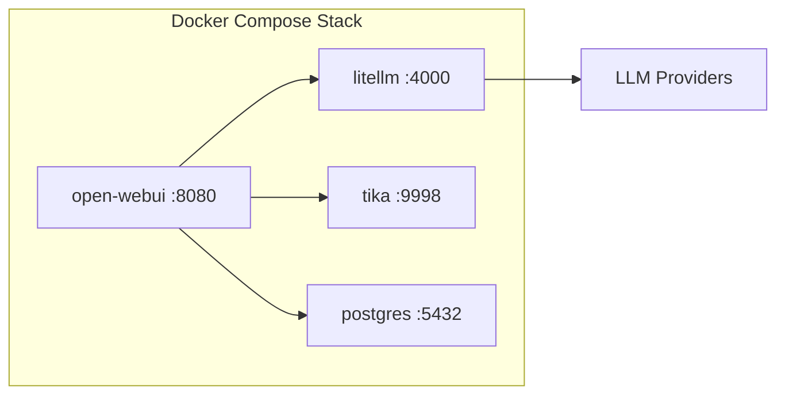

# Infrastructuur

## Deployment opties

Bij het implementeren van GovChat-NL zijn er twee hoofdkeuzes:

| Keuze | Optie A | Optie B |
|-------|---------|---------|
| **Installatie** | Docker image (aanbevolen) | Broncode |
| **Hosting** | Cloud hosting | Lokale servers |

:::tip Aanbeveling
Voor productie-omgevingen raden we **Docker** aan. Dit vereenvoudigt installatie, updates en beheer.
:::

## Docker Stack

De standaard GovChat-NL stack bestaat uit vier containers:

| Container | Image | Functie |
|-----------|-------|---------|
| **open-webui** | `ghcr.io/jeannotdamoiseaux/govchat-nl` | Web-interface en backend |
| **litellm** | `ghcr.io/berriai/litellm` | LLM router/adapter |
| **tika** | `apache/tika` | Documentverwerking |
| **postgres** | `postgres` | Database |

## Authenticatie

GovChat-NL ondersteunt meerdere authenticatiemethoden:

- **Microsoft Entra ID** (voorheen Azure AD) — SSO via OAuth/OIDC
- **Lokale authenticatie** — Gebruikersnaam en wachtwoord
- **OIDC-compatibele providers** — Elke OpenID Connect provider

## Netwerk en beveiliging

- De applicatie draait standaard op poort **8080**
- LiteLLM is alleen intern bereikbaar (niet blootgesteld aan het internet)
- Alle communicatie met LLM-providers verloopt via HTTPS
- Database is alleen intern bereikbaar

## Voorbeeldimplementaties

Zie de sectie [Implementaties](../implementaties/provincie-limburg) voor concrete voorbeelden:

- [Provincie Limburg (LAICA)](../implementaties/provincie-limburg) — Docker op Hetzner/Elestio met Azure OpenAI
- [Gemeente Meierijstad (GAIMS)](../implementaties/gemeente-meierijstad) — Docker met Azure OpenAI en WiWa-integratie
