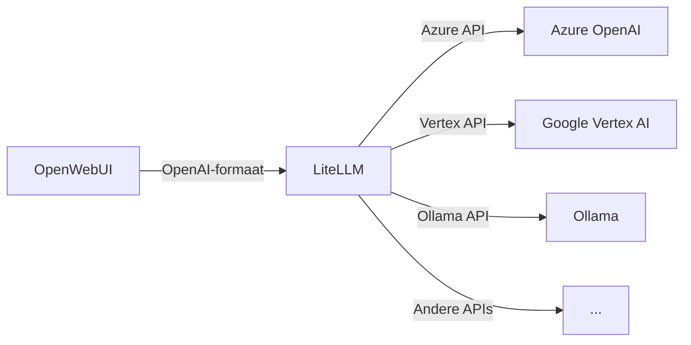
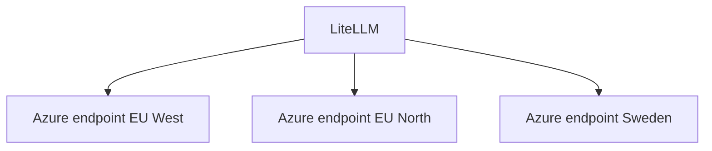

# LiteLLM

**LiteLLM** is een open-source LLM router die fungeert als tussenlaag tussen GovChat-NL en de diverse AI-modellen. Het biedt een uniforme OpenAI-compatibele API, ongeacht welke provider of model er achter zit.

## Het probleem

Overheidsorganisaties gebruiken vaak meerdere LLM-providers naast elkaar:

- **Azure OpenAI** — Voor GPT-modellen binnen de Europese cloud
- **Google Vertex AI** — Voor Gemini-modellen
- **Ollama** — Voor lokale, open-source modellen
- **Andere providers** — Anthropic, AWS Bedrock, etc.

Elke provider heeft een eigen API-formaat, authenticatiemethode en SDK. Zonder tussenlaag moet de applicatie voor elke provider apart geïntegreerd worden.

## Hoe LiteLLM dit oplost



LiteLLM vertaalt OpenAI-compatibele API-aanroepen naar het formaat van de betreffende provider. Voor OpenWebUI maakt het niet uit welke provider achter een model zit — de API is altijd hetzelfde.

## Kernfunctionaliteit

### Multi-provider routing

Configureer meerdere providers en modellen in één configuratiebestand. Gebruikers kiezen een model in de chat-interface; LiteLLM routeert het verzoek naar de juiste provider.

### Load balancing

Verdeel verkeer over meerdere endpoints van dezelfde provider:



Dit verhoogt de beschikbaarheid en voorkomt rate limiting bij één endpoint.

### Fallback

Wanneer een provider tijdelijk onbereikbaar is, schakelt LiteLLM automatisch over naar een alternatief:

```yaml
model_list:
  - model_name: gpt-4
    litellm_params:
      model: azure/gpt-4
      api_base: https://eu-west.openai.azure.com
  - model_name: gpt-4
    litellm_params:
      model: azure/gpt-4
      api_base: https://eu-north.openai.azure.com
```

Meerdere entries met dezelfde `model_name` worden automatisch gebruikt voor load balancing en fallback.

### Monitoring

LiteLLM biedt inzicht in:

- **Gebruik per model** — Welke modellen worden het meest gebruikt
- **Kosten** — Geschatte kosten per model en per gebruiker
- **Latency** — Responstijden per provider/endpoint
- **Fouten** — Overzicht van mislukte aanroepen

## Configuratie

### litellm_config.yaml

Het hoofdconfiguratiebestand definieert de beschikbare modellen:

```yaml
model_list:
  - model_name: gpt-4.1-nano
    litellm_params:
      model: azure_ai/gpt-4.1-nano
      api_base: os.environ/AZURE_API_BASE
      api_key: os.environ/AZURE_API_KEY
      api_version: os.environ/AZURE_API_VERSION

  - model_name: azure-gpt-4.1
    litellm_params:
      model: azure_ai/gpt-4.1
      api_base: os.environ/AZURE_API_BASE
      api_key: os.environ/AZURE_API_KEY
      api_version: os.environ/AZURE_API_VERSION
```

:::info
`os.environ/VARIABLE_NAME` is LiteLLM-syntax voor het uitlezen van omgevingsvariabelen. De werkelijke waarden worden ingesteld via het `.env` bestand of Docker environment variables.
:::

### Docker

LiteLLM draait als container binnen de GovChat-NL stack:

```yaml
services:
  litellm:
    image: ghcr.io/berriai/litellm
    container_name: litellm
    ports:
      - "4000:4000"
    volumes:
      - ./litellm/litellm_config.yaml:/app/config.yaml
    environment:
      - AZURE_API_BASE=${AZURE_API_BASE}
      - AZURE_API_KEY=${AZURE_API_KEY}
      - AZURE_API_VERSION=${AZURE_API_VERSION}
    command: ["--config", "/app/config.yaml"]
    restart: unless-stopped
```

### Omgevingsvariabelen

| Variabele | Beschrijving | Voorbeeld |
|-----------|-------------|-----------|
| `AZURE_API_BASE` | Azure OpenAI endpoint URL | `https://my-resource.openai.azure.com` |
| `AZURE_API_KEY` | Azure OpenAI API key | `sk-...` |
| `AZURE_API_VERSION` | Azure API versie | `2024-06-01` |

### Koppeling met OpenWebUI

OpenWebUI is geconfigureerd om LiteLLM als OpenAI-compatibele backend te gebruiken:

```bash
OPENAI_API_BASE_URL=http://litellm:4000/v1
OPENAI_API_KEY=${LITELLM_API_KEY}
```

## Voorbeeld: model toevoegen

Om een nieuw model beschikbaar te maken in GovChat-NL:

1. **Voeg het model toe** aan `litellm_config.yaml`:

```yaml
model_list:
  # Bestaande modellen...

  - model_name: gemini-pro
    litellm_params:
      model: vertex_ai/gemini-pro
      vertex_project: my-gcp-project
      vertex_location: europe-west4
```

2. **Herstart de LiteLLM container**:

```bash
docker compose restart litellm
```

3. **Het model verschijnt** automatisch in de modelselector van OpenWebUI

## Meer informatie

- [Componenten & Stack](componenten) — Alle componenten op een rij
- [Infrastructuur](infrastructuur) — Docker stack en deployment
- [Omgevingsvariabelen](../handleidingen/omgevingsvariabelen) — Alle configureerbare variabelen
- [LiteLLM documentatie](https://docs.litellm.ai/) — Officieel LiteLLM documentatie
