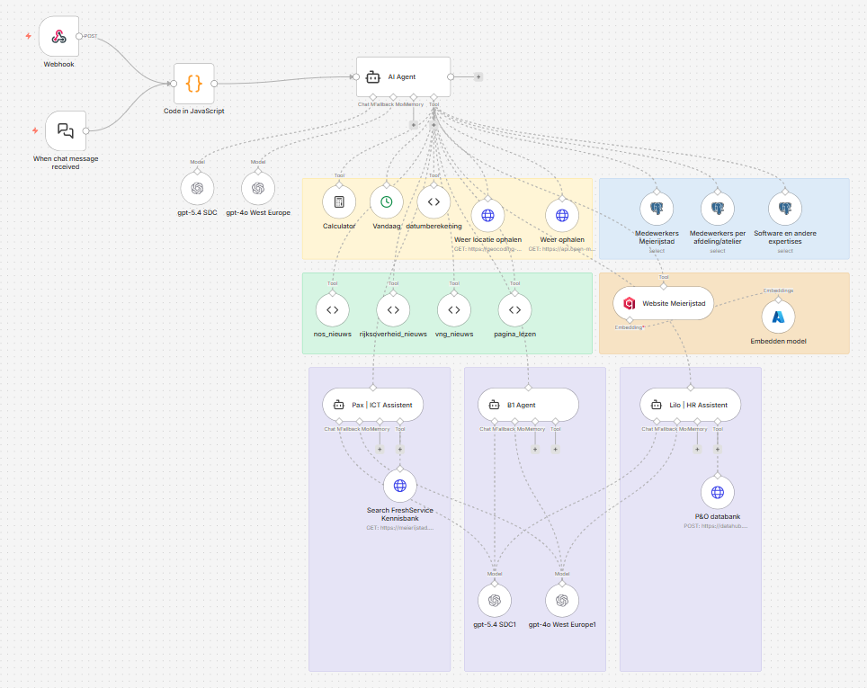

# n8n

**n8n** is een open-source workflow automation platform waarmee complexe AI-workflows visueel ontworpen en uitgevoerd kunnen worden. Binnen GovChat-NL vormt n8n de "backbone" voor apps die meer doen dan een eenvoudige chatinteractie.

## Waarom n8n?

Veel AI-toepassingen binnen de overheid vereisen meerdere stappen: een document ophalen, samenvatten, beoordelen aan criteria, en een rapport genereren. Dit soort ketens is lastig te bouwen in code alleen. n8n biedt:

- **Visuele workflow builder** — Workflows ontwerpen via drag-and-drop, zonder diepgaande programmeerkennis
- **Herbruikbare bouwblokken** — Nodes voor HTTP-requests, LLM-aanroepen, data-transformatie, bestandsbeheer en meer
- **Error handling** — Ingebouwde foutafhandeling en retry-mechanismen
- **API-endpoints** — Elke workflow kan als webhook/API beschikbaar worden gesteld

## Rol binnen GovChat-NL

GovChat-NL apps kunnen n8n workflows aanroepen om complexe, meerstaps-processen uit te voeren. De koppeling tussen OpenWebUI en n8n verloopt via een **function** in OpenWebUI.

*Voorbeeld n8n flow met Meierijstad-specifieke tools, zoals website Meierijstad, medewerkers en afdelingen, schrijfwijze Meierijstad en P&O-gerelateerde informatie.*

## Configuratie

### Docker

n8n draait als aparte container naast de GovChat-NL stack. Zie de [Gemeente Meierijstad](../implementaties/gemeente-meierijstad) implementatie voor een voorbeeld van een n8n-stack met queue-architectuur (PostgreSQL, Redis, RabbitMQ).

## Meer informatie

- [GovChat Overlay](../apps/overzicht) — Overzicht van de overlay-functionaliteit
- [Componenten & Stack](componenten) — Alle componenten op een rij
- [n8n documentatie](https://docs.n8n.io/) — Officieel n8n documentatie
