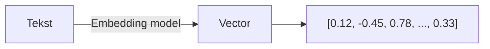
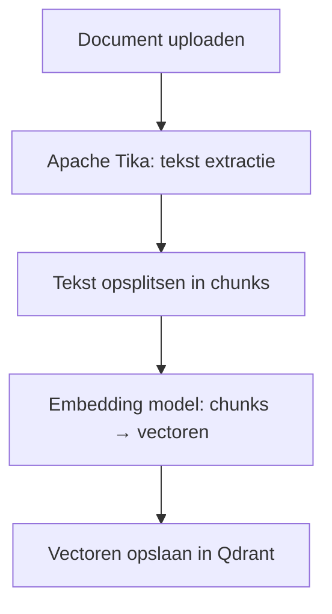
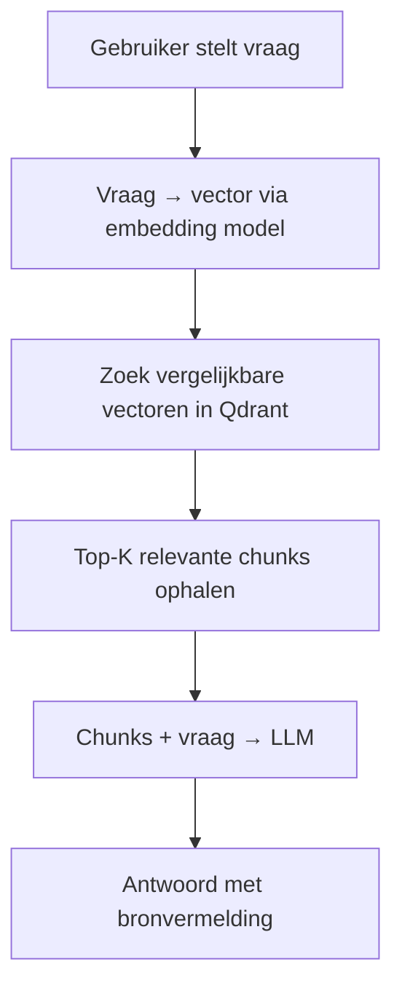

# Qdrant

**Qdrant** is een open-source vector database die binnen GovChat-NL wordt ingezet voor Retrieval Augmented Generation (RAG) en semantisch zoeken in organisatie-documenten.

## Wat is een vector database?

Een traditionele database slaat gestructureerde data op (tekst, getallen, datums) en zoekt op exacte overeenkomsten of patronen. Een **vector database** werkt fundamenteel anders: het slaat **embeddings** op — wiskundige representaties van de *betekenis* van tekst.

### Hoe werken embeddings?



Een **embedding model** zet tekst om naar een vector: een lijst van honderden tot duizenden getallen. Teksten met vergelijkbare betekenis krijgen vergelijkbare vectoren, ongeacht de exacte woorden.

| Zoekmethode | Voorbeeld zoekopdracht | Vindt |
|-------------|----------------------|-------|
| **Trefwoord** (traditioneel) | "subsidie aanvraag" | Alleen documenten met exact die woorden |
| **Semantisch** (vector) | "subsidie aanvraag" | Ook documenten over "financieringsverzoek", "steunmaatregelen", etc. |

Dit maakt het mogelijk om documenten te vinden op basis van **betekenis** in plaats van exacte trefwoorden.

## Wat is Qdrant?

Qdrant (spreek uit: "quadrant") is een vector database gebouwd in Rust, geoptimaliseerd voor:

- **Snelle similarity search** — Vind de meest vergelijkbare vectoren in milliseconden
- **Filtering** — Combineer vector-zoekopdrachten met metadata-filters
- **Schaalbaarheid** — Van duizenden tot miljoenen vectoren
- **REST en gRPC API** — Eenvoudige integratie met andere systemen

## Rol binnen GovChat-NL

Qdrant maakt de **Knowledge Base** (kennisbank) van GovChat-NL mogelijk. Wanneer een gebruiker een document uploadt of een vraag stelt, gebeurt het volgende:

### Document opslaan



1. **Upload** — Een gebruiker uploadt een PDF, Word-document of ander bestand
2. **Extractie** — Apache Tika haalt de tekst uit het bestand
3. **Chunking** — De tekst wordt opgesplitst in kleinere stukken (chunks)
4. **Embedding** — Elk chunk wordt omgezet naar een vector via een embedding model
5. **Opslag** — De vectoren worden opgeslagen in een Qdrant collectie

### Vraag beantwoorden (RAG)



1. **Vraag** — De gebruiker stelt een vraag in de chat
2. **Embedding** — De vraag wordt omgezet naar een vector
3. **Zoeken** — Qdrant vindt de meest vergelijkbare document-chunks
4. **Context** — De relevante chunks worden meegegeven aan het taalmodel
5. **Antwoord** — Het taalmodel genereert een antwoord op basis van de opgehaalde context

Dit proces heet **Retrieval Augmented Generation (RAG)**: het taalmodel wordt "verrijkt" met relevante organisatie-informatie.

## Configuratie

### Docker

Qdrant draait als container binnen de GovChat-NL stack:

```yaml
services:
  qdrant:
    image: qdrant/qdrant
    container_name: qdrant
    ports:
      - "6333:6333"
    volumes:
      - qdrant_data:/qdrant/storage
    restart: unless-stopped
```

### Collecties

Qdrant organiseert vectoren in **collecties**. OpenWebUI maakt automatisch collecties aan wanneer documenten worden geüpload. Elke collectie heeft:

- **Vector dimensie** — Afhankelijk van het gebruikte embedding model (bijv. 1536 voor OpenAI `text-embedding-3-small`)
- **Distance metric** — Standaard cosine similarity

### Koppeling met OpenWebUI

Configureer de Qdrant-verbinding in OpenWebUI via omgevingsvariabelen:

```bash
VECTOR_DB=qdrant
QDRANT_URI=http://qdrant:6333
```

### Embedding modellen

De kwaliteit van het zoeken hangt af van het gebruikte embedding model. Veelgebruikte opties:

| Model | Provider | Dimensie | Taalondersteuning |
|-------|----------|----------|-------------------|
| `text-embedding-3-small` | Azure OpenAI | 1536 | Meertalig |
| `text-embedding-3-large` | Azure OpenAI | 3072 | Meertalig |
| `nomic-embed-text` | Ollama (lokaal) | 768 | Engels / beperkt NL |

:::tip Aanbeveling
Voor Nederlandse overheidsdocumenten is `text-embedding-3-small` via Azure OpenAI een goede balans tussen kwaliteit en kosten.
:::

## Meer informatie

- [Componenten & Stack](componenten) — Alle componenten op een rij
- [Infrastructuur](infrastructuur) — Docker stack en deployment
- [Qdrant documentatie](https://qdrant.tech/documentation/) — Officieel Qdrant documentatie
