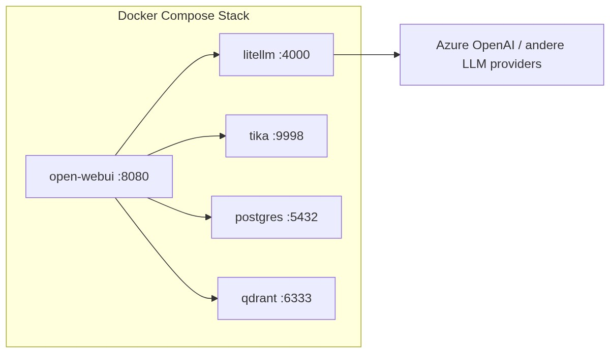

# Deployment Overzicht

Deze handleiding beschrijft hoe je GovChat-NL in productie draait met Docker Compose. De referentie compose-bestanden staan in de [GovChat-NL repository](https://github.com/GovChat-NL/GovChat-NL).

## Referentie compose-bestanden

De repository bevat productie-klare compose-bestanden:

| Bestand | Beschrijving |
|---------|-------------|
| [`docker-compose.yml`](https://github.com/GovChat-NL/GovChat-NL/blob/main/docker-compose.yml) | Basisstack: OpenWebUI + LiteLLM + PostgreSQL + Tika |
| [`.env.example`](https://github.com/GovChat-NL/GovChat-NL/blob/main/.env.example) | Template met alle omgevingsvariabelen |

## Architectuur

De productie-stack bestaat uit vier containers (vijf met RAG):



| Container | Image | Functie |
|-----------|-------|---------|
| **open-webui** | `ghcr.io/openwebui/openwebui` | Web-interface en backend |
| **litellm** | `ghcr.io/berriai/litellm` | LLM router — vertaalt naar Azure/Google/Ollama |
| **tika** | `apache/tika` | Extractie van tekst uit PDF, Word, etc. |
| **postgres** | `postgres:16` | Relationele database |
| **qdrant** *(optioneel)* | `qdrant/qdrant` | Vector database voor RAG |

## Gemeenschappelijke stappen

Ongeacht de infrastructuur (Azure, AWS, on-prem) zijn de stappen na het aanmaken van een VM gelijk:

### 1. Docker installeren

```bash
# Docker Engine + Compose plugin (Ubuntu/Debian)
curl -fsSL https://get.docker.com | sh
sudo usermod -aG docker $USER
# Log opnieuw in zodat de groepswijziging actief wordt
```

### 2. Repository klonen

```bash
git clone https://github.com/GovChat-NL/GovChat-NL.git
cd GovChat-NL
```

### 3. Omgevingsvariabelen instellen

```bash
cp .env.example .env
nano .env   # Vul alle waarden in
```

Zie [Omgevingsvariabelen](../omgevingsvariabelen) voor een volledig overzicht van alle beschikbare variabelen.

### 4. LiteLLM configureren

Pas het bestand `litellm/litellm_config.yaml` aan met jouw modellen:

```yaml
model_list:
  - model_name: gpt-4.1
    litellm_params:
      model: azure_ai/gpt-4.1
      api_base: os.environ/AZURE_API_BASE
      api_key: os.environ/AZURE_API_KEY
      api_version: os.environ/AZURE_API_VERSION
```

Zie [LiteLLM](../../architectuur/litellm) voor uitgebreide configuratie-opties.

### 5. Stack starten

```bash
docker compose up -d
```

### 6. Verificatie

```bash
# Controleer of alle containers draaien
docker compose ps

# Bekijk logs
docker compose logs -f open-webui
```

Open `http://<server-ip>:8080` in de browser. Je zou het loginscherm moeten zien.

### 7. Reverse proxy + TLS

Gebruik Nginx of Caddy als reverse proxy met een TLS-certificaat:

**Caddy (aanbevolen — automatisch HTTPS):**

```bash
sudo apt install -y caddy
```

Maak `/etc/caddy/Caddyfile`:

```
govchat.jouw-domein.nl {
    reverse_proxy localhost:8080
}
```

```bash
sudo systemctl restart caddy
```

**Nginx + Certbot:**

```bash
sudo apt install -y nginx certbot python3-certbot-nginx
```

Maak `/etc/nginx/sites-available/govchat`:

```nginx
server {
    listen 80;
    server_name govchat.jouw-domein.nl;

    location / {
        proxy_pass http://localhost:8080;
        proxy_set_header Host $host;
        proxy_set_header X-Real-IP $remote_addr;
        proxy_set_header X-Forwarded-For $proxy_add_x_forwarded_for;
        proxy_set_header X-Forwarded-Proto $scheme;

        # WebSocket support
        proxy_http_version 1.1;
        proxy_set_header Upgrade $http_upgrade;
        proxy_set_header Connection "upgrade";
    }

    client_max_body_size 50M;
}
```

```bash
sudo ln -s /etc/nginx/sites-available/govchat /etc/nginx/sites-enabled/
sudo nginx -t && sudo systemctl reload nginx
sudo certbot --nginx -d govchat.jouw-domein.nl
```

### 8. DNS instellen

Maak een A-record aan bij je DNS-provider:

```
govchat.jouw-domein.nl  →  <server-ip>
```

### 9. SSO configureren

Volg de [SSO & OAuth Configuratie](../sso-configuratie) handleiding om Microsoft Entra ID of een andere OIDC provider in te stellen.

## Updates

```bash
cd GovChat-NL
docker compose pull
docker compose up -d
```

## Volgende stappen

Kies de handleiding die past bij jouw infrastructuur:

- [Azure VM](azure-vm) — Deployment op een Azure Virtual Machine
- [AWS EC2](aws-ec2) — Deployment op een AWS EC2-instance
- [Generieke VM](generieke-vm) — Hetzner, DigitalOcean, bare metal of on-premises
