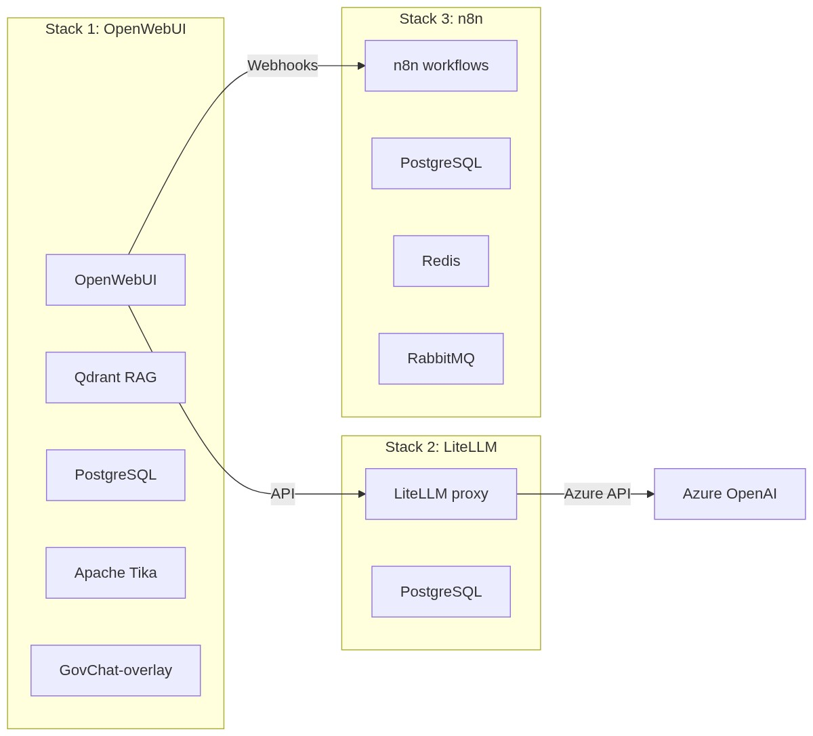

# Gemeente Meierijstad (GAIMS)

Gemeente Meierijstad was één van de eerste gemeenten die GovChat-NL in productie nam. Onder de naam **GAIMS** (Generatieve AI Meierijstad) draait de omgeving volledig intern, op eigen infrastructuur, met Microsoft Entra ID als toegangspoort. Deze pagina beschrijft hoe de omgeving is opgebouwd, welke keuzes zijn gemaakt en waarom, zodat andere gemeenten er direct van kunnen leren.

:::tip
Geschikt als referentie-implementatie. De GAIMS-opzet is bewust gedocumenteerd als voorbeeld voor andere gemeenten.
:::

## In één oogopslag

| Component | Keuze |
|-----------|-------|
| Taalmodellen | Azure OpenAI (via LiteLLM) |
| Authenticatie | Microsoft Entra ID SSO, groepsbeheer via Azure AD |
| Interface | OpenWebUI met GovChat-NL overlay (GAIMS-branding) |
| Deployment | Drie losse Docker Compose stacks |
| Beheerinterface | Portainer |
| Netwerk | 100% intern, geen publieke blootstelling |

## Wat heb je nodig voordat je begint?

Zorg dat het volgende geregeld is voordat je aan de installatie begint:

- Een actieve **Azure-omgeving** met Azure OpenAI-toegang en een Entra ID-tenant
- Een **Ubuntu Server 24.04** (of vergelijkbaar) met minimaal 4 CPU, 8 GB RAM en 250 GB opslag
- **Docker** en optioneel **Portainer** geïnstalleerd op de server
- Interne DNS of een proxyserver om de applicatie bereikbaar te maken voor medewerkers
- Afgestemde **SSO-groepen** in Azure AD die overeenkomen met de gewenste toegangsrollen in GAIMS

## Architectuur: drie losse stacks

De GAIMS-omgeving bestaat uit drie onafhankelijke Docker Compose stacks, elk op een eigen intern netwerk. Die splitsing is een bewuste keuze: een probleem in één stack heeft geen invloed op de andere, en elke stack kan apart worden bijgewerkt of opgeschaald.



### Stack 1: OpenWebUI, Qdrant en overlay

De hoofdstack bevat alles wat medewerkers direct zien en gebruiken: de webinterface, de RAG-opslag en de GAIMS-branding.

| Service | Image | Functie |
|---------|-------|---------|
| `postgresowui` | `postgres:16` | Relationele database voor OpenWebUI |
| `qdrant` | `qdrant/qdrant:latest` | Vector database voor RAG (documentzoekopdrachten) |
| `tika` | `apache/tika:latest-full` | Documentverwerking (PDF, Word, etc.) |
| `open-webui` | `ghcr.io/open-webui/open-webui` | Webinterface en backend |
| `govchat-admin` | `ghcr.io/marjoleinverp/open-webui-govchat-overlay-admin` | GovChat-NL overlay met GAIMS-branding |

De `govchat-admin` container injecteert via een gedeeld volume (`/govchat-static`) de Meierijstad-specifieke aanpassingen in OpenWebUI, zonder de basisimage aan te passen. Zo blijft de basis makkelijk bij te werken.

Compose- en voorbeeldbestanden:

- [`gaims_openwebui_docker-compose.yml`](https://github.com/GovChat-NL/GovChat-NL/blob/main/gaims_openwebui_docker-compose.yml)
- [`gaims_openwebui_example.env`](https://github.com/GovChat-NL/GovChat-NL/blob/main/gaims_openwebui_example.env)

### Stack 2: LiteLLM

LiteLLM fungeert als proxy tussen OpenWebUI en de Azure OpenAI-modellen. Door LiteLLM als losse stack te draaien, kun je modellen en routeringsregels beheren via de eigen UI, zonder de OpenWebUI-stack te herstarten. Instellingen worden opgeslagen in de database (`STORE_MODEL_IN_DB=True`), zodat er geen statische `config.yaml` nodig is.

| Service | Image | Functie |
|---------|-------|---------|
| `litellm-db` | `postgres:16-alpine` | Database voor modellen, routing en logs |
| `litellm` | `docker.litellm.ai/berriai/litellm-database:main-stable` | LLM-proxy |

Compose- en voorbeeldbestanden:

- [`gaims_litellm_docker-compose.yml`](https://github.com/GovChat-NL/GovChat-NL/blob/main/gaims_litellm_docker-compose.yml)
- [`gaims_litellm_example.env`](https://github.com/GovChat-NL/GovChat-NL/blob/main/gaims_litellm_example.env)

### Stack 3: n8n (workflowautomatisering)

De n8n-stack maakt het mogelijk om geautomatiseerde workflows te bouwen rondom GAIMS, zoals het verwerken van documenten of het koppelen van interne systemen. De queue-architectuur (PostgreSQL + Redis + RabbitMQ) zorgt ervoor dat zwaardere taken parallel en betrouwbaar worden afgehandeld.

| Service | Image | Functie |
|---------|-------|---------|
| `postgres_n8n` | `postgres:16` | Database voor n8n-workflows |
| `redis` | `redis:latest` | Caching en sessieopslag |
| `rabbit` | `rabbitmq:3-management` | Message broker voor de queue |

:::info
Specifiek voor Meierijstad. De n8n-stack is niet opgenomen in de gedeelde GovChat-NL repository. Deze wordt mogelijk later toegevoegd.
:::

## Authenticatie en gebruikersbeheer

GAIMS gebruikt **Microsoft Entra ID SSO** op basis van groepen. Medewerkers loggen in met hun bestaande organisatieaccount. Via de `OAUTH_GROUP_CLAIM`-instelling worden groepen automatisch gesynchroniseerd vanuit Azure AD, zodat toegangsbeheer centraal en per afdeling of rol beheerd wordt. Nieuwe medewerkers die aan de juiste groep worden toegevoegd, krijgen automatisch toegang zonder handmatige actie in GAIMS zelf.

## Branding

De interface is voorzien van Meierijstad-branding via de GovChat-overlay:

- Handleiding toegevoegd
- App Selector toegevoegd

## Beveiliging

**Netwerkinsolatie.** Alle drie de stacks draaien op eigen interne Docker-netwerken. Alleen de OpenWebUI-interface is bereikbaar voor medewerkers, via een interne proxyserver. Er is geen directe publieke toegang tot de server of de beheerinterfaces.

**Toegang tot Portainer.** Portainer is uitsluitend bereikbaar via het interne netwerk op poort 9443. Beheerrechten zijn beperkt tot een kleine groep IT-beheerders.

**Secrets management.** Wachtwoorden en API-sleutels worden beheerd als omgevingsvariabelen in Portainer, niet als platte tekst in bestanden op de server. Zorg ervoor dat de Portainer-omgeving zelf ook goed beveiligd is (sterke wachtwoorden, geen standaardinstellingen).

:::warning
Let op bij productie. De serverspecificaties in deze implementatie (4 CPU, 8 GB RAM, 250 GB opslag) zijn gebruikt voor een testomgeving. Beoordeel zelf of dit voldoende is voor het verwachte gebruik in jouw gemeente, en schaal op waar nodig.
:::

## Installatie stap voor stap

### 1. Server inrichten

Meierijstad gebruikt een Ubuntu Server 24.04 als basis. De server draait volledig intern en is alleen bereikbaar via geautoriseerde endpoints voor medewerkers in de juiste SSO-groepen.

### 2. Docker installeren

```bash
# Installeer benodigde pakketten
sudo apt update
sudo apt install -y ca-certificates curl gnupg

# Voeg de Docker GPG-sleutel toe
sudo install -m 0755 -d /etc/apt/keyrings
curl -fsSL https://download.docker.com/linux/ubuntu/gpg | sudo gpg --dearmor -o /etc/apt/keyrings/docker.gpg

# Voeg de Docker repository toe
echo \
  "deb [arch=$(dpkg --print-architecture) signed-by=/etc/apt/keyrings/docker.gpg] https://download.docker.com/linux/ubuntu \
  $(lsb_release -cs) stable" | \
  sudo tee /etc/apt/sources.list.d/docker.list > /dev/null

# Installeer Docker
sudo apt update
sudo apt install -y docker-ce docker-ce-cli containerd.io
```

### 3. Portainer installeren

Het GAIMS-team beheert Docker via Portainer, een grafische beheerinterface. Dat maakt het toegankelijker voor IT-beheerders die minder gewend zijn aan de command line.

```bash
# Maak een volume aan voor Portainer-data
sudo docker volume create portainer_data

# Start Portainer
sudo docker run -d -p 9443:9443 -p 8000:8000 \
  --name portainer \
  --restart=always \
  -v /var/run/docker.sock:/var/run/docker.sock \
  -v portainer_data:/data \
  portainer/portainer-ce:latest
```

Na de installatie is Portainer bereikbaar via `https://[serverip]:9443`.

### 4. Mappen aanmaken

```bash
mkdir -p /opt/docker/openwebui/postgres/pgdata
mkdir -p /opt/docker/openwebui/qdrant/qdrant_storage
mkdir -p /opt/docker/openwebui/pgadmin/pgadmin_data
mkdir -p /opt/docker/openwebui/openwebui/openwebui_data
mkdir -p /opt/docker/openwebui/openwebui/govchat-static
mkdir -p /opt/docker/openwebui/openwebui/govchat-admin-data
```

### 5. Stacks aanmaken in Portainer

Maak in Portainer de OpenWebUI-stack en de LiteLLM-stack aan via de bovenstaande compose-bestanden. Vul de omgevingsvariabelen in via de Portainer-interface, niet in de bestanden zelf.

:::info
Proxyserver. Meierijstad ontsluit GAIMS via een interne proxyserver. De configuratie daarvan is afhankelijk van de eigen infrastructuur en is niet opgenomen in deze documentatie.
:::

## Geleerde lessen

- Gebruik Portainer als beheertool als je team meer gewend is aan een GUI dan aan de command line. Het verlaagt de drempel aanzienlijk.
- Houd de drie stacks bewust gescheiden. Het kost iets meer inrichtingstijd, maar geeft veel meer controle en minder risico bij updates of storingen.
