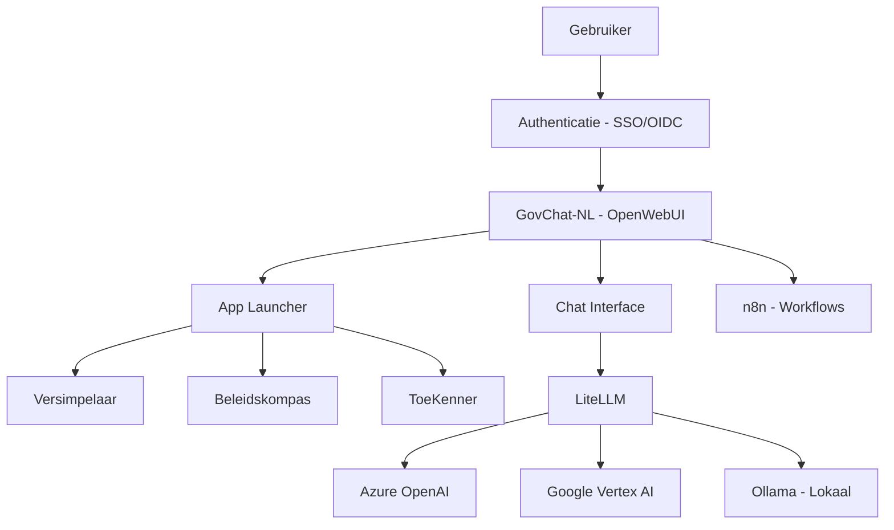

# Wat is GovChat-NL?

GovChat-NL is een open-source platform voor en door Nederlandse overheidsorganisaties dat ondersteunt bij het implementeren en beheren van AI-oplossingen. Het platform is ontstaan bij de **Provincie Limburg** vanuit de behoefte aan een betrouwbare, veilige en toegankelijke digitale assistent voor overheidsmedewerkers.

## Kernprincipes

### Modulair opgebouwd

Dankzij de flexibele, modulaire architectuur is GovChat-NL eenvoudig uit te breiden of aan te passen aan de specifieke behoeften van uw organisatie.

### Digitaal autonoom

De technologie van GovChat-NL is volledig in eigen beheer en staat garant voor privacy, gegevensbescherming en digitale soevereiniteit. Je bent niet langer afhankelijk van grote, internationale techbedrijven.

### Overheid specifiek en taakgericht

GovChat-NL is ontworpen voor en door de overheid en sluit aan op de processen en taken binnen de publieke sector. Naast de chatfunctionaliteit biedt het platform via de **App Launcher** direct inzetbare AI-tools, specifiek voor overheidstaken.

## Architectuuroverzicht

## Technologiestack

| Component | Rol |
|-----------|-----|
| **OpenWebUI** | Web-interface en backend — chat, gebruikersbeheer, App Launcher |
| **LiteLLM** | Router en adapter tussen applicatie en AI-modellen |
| **n8n** | Workflow automation voor complexe AI-workflows |
| **Apache Tika** | Documentverwerking (PDF, Word, etc.) |
| **PostgreSQL** | Database voor gebruikers, chats, configuratie |

## Versiehistorie

| Versie | Datum | OpenWebUI versie | Opmerkingen |
|--------|-------|------------------|-------------|
| v0.1.1 | 26 januari 2026 | v0.7.2 | Huidige versie |
| v0.1.0 | 18 juli 2025 | v0.6.13 | Eerste release |
