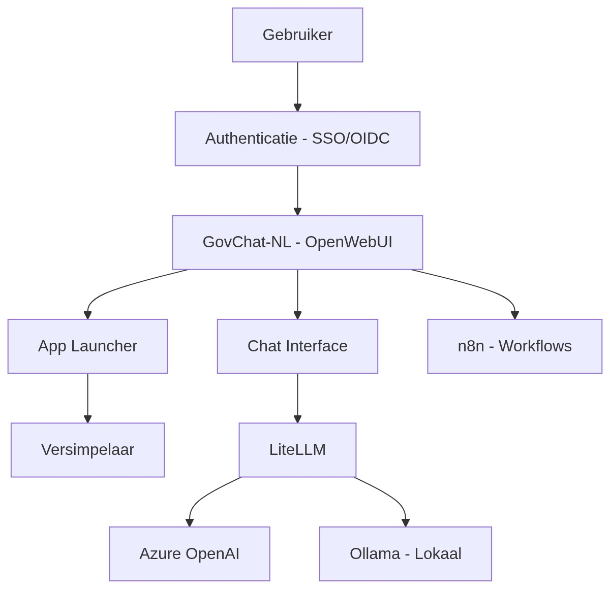

# Wat is GovChat-NL?

GovChat-NL is een open-source platform voor en door Nederlandse overheidsorganisaties dat ondersteunt bij het implementeren en beheren van AI-oplossingen. Het platform is ontstaan bij de **Provincie Limburg** vanuit de behoefte aan een betrouwbare, veilige en toegankelijke digitale assistent voor overheidsmedewerkers.

## Waarom GovChat-NL?

Overheidsorganisaties in Nederland staan voor dezelfde uitdaging: hoe zetten we generatieve AI in op een manier die veilig is, privacyproof, en die ambtenaren echt ondersteunt in hun dagelijks werk — zonder afhankelijk te worden van commerciële platforms die buiten onze controle liggen?

GovChat-NL is het antwoord dat we samen bouwen. Niet als product dat je koopt, maar als gemeenschappelijk goed dat we met elkaar beheren, verbeteren en delen.

## Kernwaarden

### Open by default

De broncode vormt de absolute kern van onze samenwerking. Met 'broncode' bedoelen we specifiek onze overheidsspecifieke toevoegingen op bestaande open-source componenten: de GovChat-NL overlay-code, agents, workflows en documentatie. Daarnaast delen we onze opgedane kennis en kaders, waaronder kwaliteitsnormen en compliancedocumenten (zoals DPIA's). Wat wij bouwen en uitdenken, doen we voor de hele overheid.

### Digitale autonomie

We bouwen op open standaarden en vermijden afhankelijkheid van één leverancier, platform of land. Elke organisatie behoudt volledige controle over haar eigen implementatie en data.

### Veiligheid en privacy als fundament

Informatiebeveiliging en privacybescherming zijn ingebouwd in het platform en in onze werkwijze. Dankzij gedeelde kaders en (geanonimiseerde) DPIA's kan iedere organisatie verantwoord starten zonder het wiel opnieuw uit te vinden.

### Samen bouwen, samen profiteren

Wat één organisatie ontwikkelt, kan iedere andere organisatie gebruiken. Commerciële partijen zijn welkom als bijdrager aan de code, binnen de voorwaarden van de geldende open [licenties](licenties).

## Architectuuroverzicht

## Technologiestack

| Component | Rol | Documentatie |
|-----------|-----|-------------|
| **OpenWebUI** | Web-interface en backend — chat, gebruikersbeheer, App Launcher | [Componenten](../architectuur/componenten) |
| **LiteLLM** | Router en adapter tussen applicatie en AI-modellen | [LiteLLM](../architectuur/litellm) |
| **n8n** | Workflow automation voor complexe AI-workflows | [n8n](../architectuur/n8n) |
| **Apache Tika** | Documentverwerking (PDF, Word, etc.) | [Componenten](../architectuur/componenten) |
| **Qdrant** | Vector database voor RAG en kennisbank-functionaliteit | [Qdrant](../architectuur/qdrant) |
| **PostgreSQL** | Database voor gebruikers, chats, configuratie | [Infrastructuur](../architectuur/infrastructuur) |
